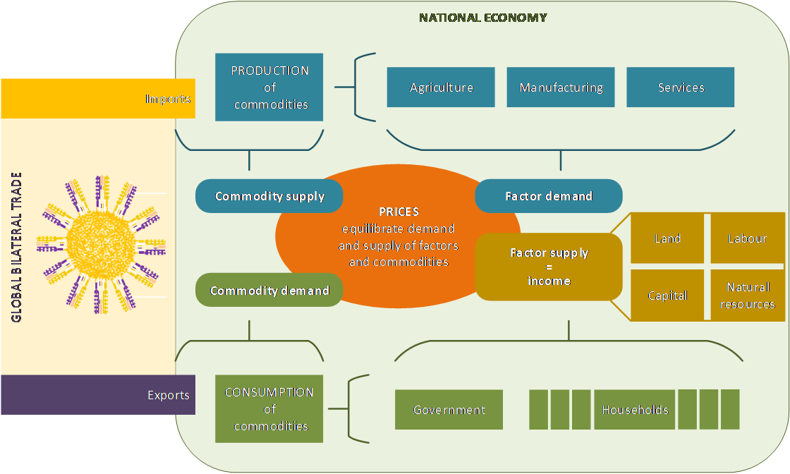

---
# An instance of the Blank widget.
# Documentation: https://sourcethemes.com/academic/docs/page-builder/
widget: blank

# Activate this widget? true/false
active: true

# This file represents a page section.
headless: true

# Order that this section appears on the page.
weight: 15

title: Model
subtitle:

design:
  columns: "1"
---

MAGNET stands for the Modular Applied GeNeral Equilibrium Tool. It is a global computable general equilibrium model, which can be flexibly tailored to specific research questions at hand and regions and products of interest. MAGNET is the successor of the LEITAP model extensively used in policy analyses in the past. Both LEITAP and MAGNET are based on the standard GTAP model. The core of MAGNET is the GTAP model, to which multiple adaptions and extensions have been added, including those listed below. Noteworthy, MAGNET is compatible with both GTAPv6 and GTAPv7.

-   Differences in substitutability of land between sectors
-   Imperfect mobility of labor between agricultural and non-agricultural sectors
-   Output quotas for milk and sugar
-   Endogenous land supply
-   Biofuel sectors (1st and 2nd generation) and the biofuel directive
-   Modulation of the EU common agricultural policy from first to second pillar measures
-   Income elasticities dependent on GDP per capita
-   International capital mobility for dynamic analyses
-   Nutrition indicators
-   Household food security indicators
-   Circularity module: municipal solid waste flows and treatment options
-   Aquaculture and seaweed sectors
-   Endogenous natural resource stocks
-   Emission permit trading and mac curves, luluc emissions
-   Climate damage assessment
-   Adaptions for investments, bilateral tariff rate quota, alternative consumption functions etc.

## The Foundation of MAGNET: GTAP Core

The standard GTAP model (Version 6.2 of September 2003) was the starting point for developing MAGNET. GTAP is a general equilibrium model covering all sectors of the economy (agriculture, manufacturing and services) in contrast to partial equilibrium models, which focus on subsets of an economy. GTAP is a global model, covering all regions and major countries in the world. A region may include several countries for which there is no individual country data.

*Figure 1: MAGNET -- an economic model of nations in the global economy* 

In the GTAP model, the regional household supplies factors (i.e. land, skilled and unskilled labour, capital and natural resources) to the production sectors. By combining these factors with intermediate inputs from other sectors, commodities are produced. Produced commodities are either supplied to domestic markets to satisfy the demand for commodities by private households and governments or they are exported.

For every region in the model there is a single representative household demanding consumption goods (including savings) on the behalf of the private household and the government. Total demand is determined by income earned by land, labour and capital as well as income from taxes. The demand for goods can be met by national producers or by imports. Each commodity is produced by one sector, while each sector produces only one commodity. For each sector there is a single producer, i.e. there is one producer of wheat, one for gas, one for wood products, etc.

The model includes trade between all regions in the model and accounts for trade barriers between regions via tariffs. These tariffs may drive a wedge between prices in regions, i.e. the same product may be more expensive in one region than in another because of tariffs. Whereas international trade is modelled by tracing all bilateral flows, international capital flows are governed by a global bank. This bank collects savings and uses them for international investments. Since savings are pooled by the global bank before being used for investments, it is not possible to trace bilateral capital flows.

Prices of goods and of land, labour and capital in each region adjust to assure that both national and international demand and supply are equal, hence the term general equilibrium model. Thus, when a policy simulation is run, for example to analyze the impacts of lowering tariffs between regions, the model computes by sector the production, consumption and trade (both imports and exports) as well as price levels that result in equilibrium in national and international markets.

More information on the standard GTAP model can be found on the [GTAP website](https://www.gtap.agecon.purdue.edu).

## MAGNET Philosophy

The development of MAGNET has been driven by the following key principles:

-   A modular set-up around a GTAP core: the modular set-up has been designed such that all model extensions can be switched on through choices in a single parameter file, sometimes in combination with changes in closure file. This allows new users to start with GTAP and then add extensions as needed. For experienced users it facilitates the tailoring of the model structure to the research question at hand, and eases debugging when developing the model. The GTAP model was chosen as a starting point because it is a widely used CGE model and the associated GTAP network provides a common background which enables comparison with a wide variety of other CGE models developed from the GTAP model.

-   The GTAP core is kept intact with only minimal changes. A notable change is the introduction of a distinction between production sectors and produced commodities throughout the model to introduce by-products. Data are kept and processed at the lowest level of detail to allow the user to aggregate the GTAP regions into groups that are relevant for the research question. All databases are kept as provided by their original sources and processed at the lowest level of detail.

-   All data changes and adjustments are coded in GEMPACK to enhance tractability and quality control. In addition, this approach facilitates the updating of datasets since the same code can be applied to the updates.

## MAGNET Regions and Countries

MAGNET covers 141 regions and countries (table 1). Currently (2020), MAGNET is based on Version 10 of the GTAP database.

*Table 1: MAGNET countries and regions*

|                    |                                  |                    |                             |                    |                               |
|--------------------|----------------------------------|--------------------|-----------------------------|--------------------|-------------------------------|
| **Country number** | **Country name**                 | **Country number** | **Country name**            | **Country number** | **Country name**              |
| 1                  | Australia                        | 48                 | Rest of Central America     | 95                 | Armenia                       |
| 2                  | New Zealand                      | 49                 | Dominican Republic          | 96                 | Azerbaijan                    |
| 3                  | Rest of Oceania                  | 50                 | Jamaica                     | 97                 | Georgia                       |
| 4                  | China                            | 51                 | Puerto Rico                 | 98                 | Bahrain                       |
| 5                  | Hong Kong                        | 52                 | Trinidad and Tobago         | 99                 | Iran Islamic Republic of      |
| 6                  | Japan                            | 53                 | Caribbean                   | 100                | Israel                        |
| 7                  | Korea Republic of                | 54                 | Austria                     | 101                | Kuwait                        |
| 8                  | Mongolia                         | 55                 | Belgium                     | 102                | Jordan                        |
| 9                  | Taiwan                           | 56                 | Bulgaria                    | 103                | Oman                          |
| 10                 | Rest of East Asia                | 57                 | Croatia                     | 104                | Qatar                         |
| 11                 | Brunei Darussalam                | 58                 | Cyprus                      | 105                | Saudi Arabia                  |
| 12                 | Cambodia                         | 59                 | Czech Republic              | 106                | Turkey                        |
| 13                 | Indonesia                        | 60                 | Denmark                     | 107                | United Arab Emirates          |
| 14                 | Lao People's Democratic Republic | 61                 | Estonia                     | 108                | Rest of Western Asia          |
| 15                 | Malaysia                         | 62                 | Finland                     | 109                | Egypt                         |
| 16                 | Philippines                      | 63                 | France                      | 110                | Morocco                       |
| 17                 | Singapore                        | 64                 | Germany                     | 111                | Tunisia                       |
| 18                 | Thailand                         | 65                 | Greece                      | 112                | Rest of North Africa          |
| 19                 | Viet Nam                         | 66                 | Hungary                     | 113                | Benin                         |
| 20                 | Rest of Southeast Asia           | 67                 | Ireland                     | 114                | Burkina Faso                  |
| 21                 | Bangladesh                       | 68                 | Italy                       | 115                | Cameroon                      |
| 22                 | India                            | 69                 | Latvia                      | 116                | Cote d'Ivoire                 |
| 23                 | Nepal                            | 70                 | Lithuania                   | 117                | Ghana                         |
| 24                 | Pakistan                         | 71                 | Luxembourg                  | 118                | Guinea                        |
| 25                 | Sri Lanka                        | 72                 | Malta                       | 119                | Nigeria                       |
| 26                 | Rest of South Asia               | 73                 | Netherlands                 | 120                | Senegal                       |
| 27                 | Canada                           | 74                 | Poland                      | 121                | Togo                          |
| 28                 | United States of America         | 75                 | Portugal                    | 122                | Rest of Western Africa        |
| 29                 | Mexico                           | 76                 | Romania                     | 123                | Central Africa                |
| 30                 | Rest of North America            | 77                 | Slovakia                    | 124                | South Central Africa          |
| 31                 | Argentina                        | 78                 | Slovenia                    | 125                | Ethiopia                      |
| 32                 | Bolivia, Plurinational State of  | 79                 | Spain                       | 126                | Kenya                         |
| 33                 | Brazil                           | 80                 | Sweden                      | 127                | Madagascar                    |
| 34                 | Chile                            | 81                 | United Kingdom              | 128                | Malawi                        |
| 35                 | Colombia                         | 82                 | Switzerland                 | 129                | Mauritius                     |
| 36                 | Ecuador                          | 83                 | Norway                      | 130                | Mozambique                    |
| 37                 | Paraguay                         | 84                 | Rest of EFTA                | 131                | Rwanda                        |
| 38                 | Peru                             | 85                 | Albania                     | 132                | Tanzania United Republic of   |
| 39                 | Uruguay                          | 86                 | Belarus                     | 133                | Uganda                        |
| 40                 | Venezuela                        | 87                 | Russian Federation          | 134                | Zambia                        |
| 41                 | Rest of South America            | 88                 | Ukraine                     | 135                | Zimbabwe                      |
| 42                 | Costa Rica                       | 89                 | Rest of Eastern Europe      | 136                | Rest of Eastern Africa        |
| 43                 | Guatemala                        | 90                 | Rest of Europe              | 137                | Botswana                      |
| 44                 | Honduras                         | 91                 | Kazakhstan                  | 138                | Namibia                       |
| 45                 | Nicaragua                        | 92                 | Kyrgyzstan                  | 139                | South Africa                  |
| 46                 | Panama                           | 93                 | Tajikistan                  | 140                | Rest of South African Customs |
| 47                 | El Salvador                      | 94                 | Rest of Former Soviet Union | 141                | Rest of the World             |

## MAGNET Sectors and Commodities

MAGNET covers 113 sectors and 127 commodities (table 2). Currently (2020), MAGNET is based on Version 10 of the GTAP database.

*Table 2: MAGNET and GTAP sectors/commodities*

|        |                                |        |                                |        |                                    |
|--------|--------------------------------|--------|--------------------------------|--------|------------------------------------|
| Number | Name                           | Number | Name                           | Number | Name                               |
| 1      | Paddy rice                     | 23     | Processed rice                 | 45     | Manufactures nec                   |
| 2      | Wheat                          | 24     | Sugar                          | 46     | Electricity                        |
| 3      | Cereal grains nec              | 25     | Food products nec              | 47     | Gas manufacture, distribution      |
| 4      | Vegetables, fruit, nuts        | 26     | Beverages and tobacco products | 48     | Water                              |
| 5      | Oil seeds                      | 27     | Textiles                       | 49     | Construction                       |
| 6      | Sugar cane, sugar beet         | 28     | Wearing apparel                | 50     | Trade                              |
| 7      | Plant-based fibers             | 29     | Leather products               | 51     | Accommodation, Food and service    |
| 8      | Crops nec                      | 30     | Wood products                  | 52     | Transport nec                      |
| 9      | Bovine cattle, sheep and goats | 31     | Paper products, publishing     | 53     | Water transport                    |
| 10     | Animal products nec            | 32     | Petroleum, coal products       | 54     | Air transport                      |
| 11     | Raw milk                       | 33     | Chemical products              | 55     | Warehousing and support activities |
| 12     | Wool, silk-worm cocoons        | 34     | Basic pharmaceutical products  | 56     | Communication                      |
| 13     | Forestry                       | 35     | Rubber and plastic products    | 57     | Financial services nec             |
| 14     | Fishing                        | 36     | Mineral products nec           | 58     | Insurance                          |
| 15     | Coal                           | 37     | Ferrous metals                 | 59     | Real estate activities             |
| 16     | Oil                            | 38     | Metals nec                     | 60     | Business services nec              |
| 17     | Gas                            | 39     | Metal products                 | 61     | Recreational and other service     |
| 18     | Minerals nec                   | 40     | Computer, electronic and optic | 62     | Public Administration and defe     |
| 19     | Bovine meat products           | 41     | Electrical equipment           | 63     | Education                          |
| 20     | Meat products nec              | 42     | Machinery and equipment nec    | 64     | Human health and social work a     |
| 21     | Vegetable oils and fats        | 43     | Motor vehicles and parts       | 65     | Dwellings                          |
| 22     | Dairy products                 | 44     | Transport equipment nec        |        |                                    |

*Table 3: Additional MAGNET sectors/commodities*

|        |                           |        |                                 |        |                              |
|--------|---------------------------|--------|---------------------------------|--------|------------------------------|
| Number | Name                      | Number | Name                            | Number | Name                         |
| 66     | Animal feed               | 82     | Mixed fossil biochemical sector | 98     | Crustaceans                  |
| 67     | Crude vegetable oil       | 83     | Electricity from coal           | 99     | Marine fish                  |
| 68     | Biogasoline               | 84     | Electricity from gas            | 100    | Molusks                      |
| 69     | Biodiesel                 | 85     | Electricty from nuclear         | 101    | Fish processing              |
| 70     | Fertilizer nutrient n     | 86     | Electricty from hydro           | 102    | Bioplastics                  |
| 71     | Fertilizer nutrient p     | 87     | Electricty from wind and solar  | 103    | Fossil kerosine              |
| 72     | Fertilizer nutrient k     | 88     | Bioelectricity 2nd gen          | 104    | Biokerosine                  |
| 73     | Biofuel feedstock grains  | 89     | Residue sector                  | 105    | Waste Collection rest waste  |
| 74     | Biofuel feedstock sugar   | 90     | Pellet sector                   | 106    | Waste collection green waste |
| 75     | Biofuel feedstock molasse | 91     | Plantation                      | 107    | Composting                   |
| 76     | Biofuel feedstock oils    | 92     | Poultry live animals            | 108    | Incineration                 |
| 77     | Ftfuel 2nd gen biofuel    | 93     | Poultry meat                    | 109    | Landfilling                  |
| 78     | Ethanol 2nd gen biofuels  | 94     | Beef cattle                     | 110    | Waste collection glass paper |
| 79     | Ligno sugar               | 95     | Beaf meat                       | 111    | Recycling                    |
| 80     | Pe biochemical            | 96     | Diadromis fish                  | 112    | Heat                         |
| 81     | Pla biochemical           | 97     | Fresh water fish                | 113    | Bioheat                      |
|        |                           |        |                                 | 114    | Seaweed                      |

*Table 4: Additional MAGNET commodities - byproducts*

|        |                                                          |
|--------|----------------------------------------------------------|
| Number | Name                                                     |
| 114    | DDGS: byproduct of Biogasoline sector                    |
| 115    | Molasse: buproduct of Sugar sector                       |
| 116    | Oil cake: byproduct of Crude vegetable oil sector        |
| 117    | Residue pdr: byproduct of Paddy rice sector              |
| 118    | Residue wheat: byproduct of Wheat sector                 |
| 119    | Residue gro**:** byproduct of Cereal grains nec sector   |
| 120    | Residue osd: byproduct of Oil seeds sector               |
| 121    | Residue ocr: byproduct of Cereal grains nec sector       |
| 122    | Residue frs: byproduct of Forestry sector                |
| 123    | Residue v_f: byproduct of Vegetables, fruit, nuts sector |
| 124    | Fish meal: byproduct of Fish processing sector           |
| 125    | Biomass: byproduct of Composting sector                  |
| 126    | Recycled paper and glass: byproduct of Recycling sector  |
| 127    | Energy from waste: byproduct of Incineration sector      |

## Software and System Requirements

Requirements for running the entire MAGNET system include the following:

-   Software licenses for GEMPACK, INTEL FORTRAN Compiler 11 (64 bit)
-   Data licenses for at least one GTAP database, use of specific modules may require additional database licenses
-   64 bit machine with at least 16 GB RAM
-   For DSS (the modelling interface) .Net 4.0 is required; can be freely downloaded, but must be installed
-   GTREE (the code viewer and editor) must be installed, available for free on request
-   Preferably an SVN server is available; for easy tracking of adjustments made to data and programs and updating to new versions of MAGNET.
