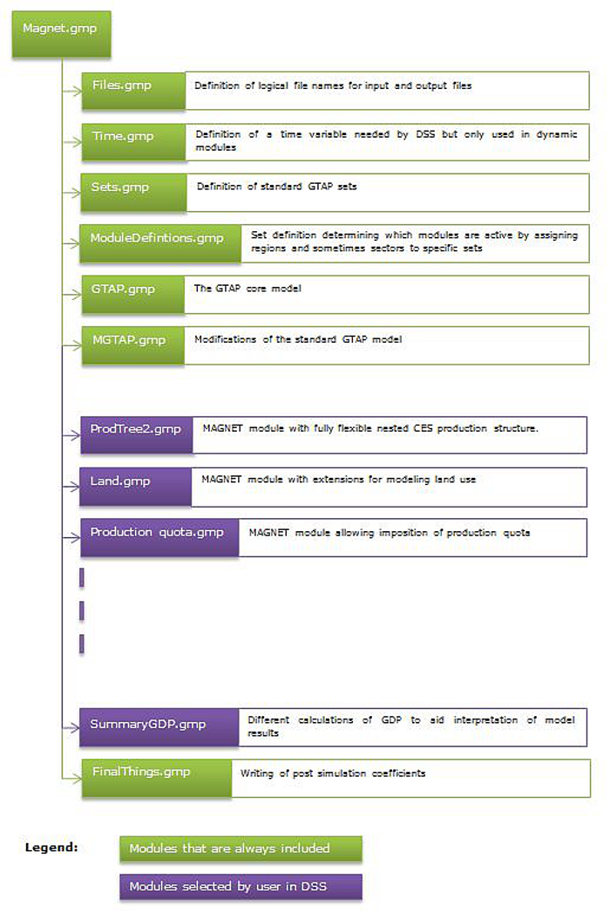

---
# An instance of the Blank widget.
# Documentation: https://sourcethemes.com/academic/docs/page-builder/
widget: blank

# Activate this widget? true/false
active: true

# This file represents a page section.
headless: true

# Order that this section appears on the page.
weight: 15

title: Modules
subtitle:

design:
  columns: "1"
---



MAGNET has a modular structure, with some modules required and some optional in each model run (Figure 1). Users can select from a number of available modules summarized below.

*Figure 1: Running MAGNET: Compulsory versus Optional Modules*

## Module 1: Flexible production structure

To allow for different organization of production across different types of sectors in an economy, a flexible production structure is introduced. For each sector in model, the users can choose one out of several types of production structure available. The module lets the users decide the number of nests in each production structure (the number can differ across production structure to allow for a simpler or more complex organization of production process). In addition to the number of nests, users can also decide about combinations of intermediate inputs that enter a nest. These combinations of inputs are allowed to vary by type of production structure. This module allows for differential production organization across sectors within an economy.

Contact: [Heleen Bartelings](/author/heleen-bartelings/)

## Module 2: Land supply

Understanding how land use changes over time and with different policies is fundamentally important for the discussions on climate change, agricultural land-use and biodiversity. Most CGE models do not account for possible changes in the total amount of agricultural land available and only account for a given fixed land amount moving across sectors. The land supply module in MAGNET uses a land supply curve to describe the relationship between average real agricultural land rent and the area of land in a country that is used for agriculture. Two variants of endogenous land supply are available: one with fixed in time agricultural land availability and one which allows on agricultural land availability changing over time (Dixon land supply function).

Contact: [Andrzej Tabeau](/author/andrzej-tabeau/)

## Module 3: Land allocation

Moving land from one use to another involves adjustments costs. To capture this, the GTAP model treats land as a sluggish input with a CET function determining the allocation across different land uses. The module differs from the GTAP CET land allocation in two ways: a) the number of available nests is different and, b) an option exists of including forests as a land use (providing a way to model land competition between agriculture and forests). This module also offers the users the choice of treating land as a perfectly mobile endowment.

Contact: [Andrzej Tabeau](/author/andrzej-tabeau/)

## Module 4: Modified consumption function

In long term projections, incomes often change considerably. This has implications for composition of consumption. To capture such changes more realistically, this module allows adjustment in income elasticities (as GDP per capita changes) over time in order to improve private consumption outcomes, including total calorie intake (see the Nutrition module) as well as dietary patterns.

Contact: [Andrzej Tabeau](/author/andrzej-tabeau/)

## Module 5: Segmented factor markets for mobile endowments

Divergent developments in wages and capital returns across agricultural and non-agricultural sectors can play an important role in long term projections of factor use and sector development. Two modules allows on modelling segmentation of mobile factors markets. The first module is developed on the basis of GTAP-Agr model. It introduces segmented (agriculture and non-agriculture) markets for mobile factors - labour and capital. It uses CET function which mimics the lesser degree of agricultural factor employability in non-agriculture sectors and vice-versa. The second module introduces the same market segmentation by mean of a dynamic migration function. In the module agricultural, endowments moves outside of agriculture if renumeration of these endowments is lower the reservation renumeration.

Contact: [Andrzej Tabeau](/author/andrzej-tabeau/)

## Module 6: Energy, biochemicals  and Bio-fuel directives

Energy use in MAGNET is split into fossil based energy (gas, coal and nuclear) and fossil based heat on the one side and bioenergy (wind, hydro and biomass) and bio heat on the other side. The detailed sector information for both electricity and heat are indispensable components of the transition from fossil based to renewable bioeconomy.

This module also introduces the first and second generation bio-fuels for road transport and aviation bio-fuel into the model, along with their directive targets for blending with fossil fuels. The module also calculates the subsidies needed by bio-fuel sectors in order to meet the stated directives. These subsidies are financed by taxing the fossil fuels in both its forms – as an input into the blended commodity and also in its non-blended uses.

Finally the module also focusses on analyzing the increased use of biochemicals (bio plastics, bio pharmaceutical and biochemicals and innovative sectors like pe and pla bioplastic sectors).

Contact: [Heleen Bartelings](/author/heleen-bartelings/)

## Module 7: GHG Emissions

Greenhouse gases (GHG) prevent heat from the earth from escaping into space, causing the greenhouse effect. They contribute to warming up of the earth and climate change. The emissions module is used to calculate emissions of GHG gases – CO2, N2O and CH4. Both combustion and non-combustion emissions are included in this accounting. Emissions can be tracked by gas type, fuel type, emitting sector and region. In addition to accounting for emissions, the module also introduces – a) the possibility to tax emissions by introducing a carbon tax, b) the possibility of switching to a lower emission intensity (if such option is technically feasible) as a result of either carbon tax imposition or through compensating sectors their abatement costs arising from switching to lower emission intensity. It also includes the possibility for regions to participate in emission trading scheme.

Contact: Jason Levin-Koopman

## Module 8: Production quota

The production quota module allows the imposition of an upper bound on production in selected sectors and regions. This can for example be used to model European agricultural policies that impose limits on milk and sugar output. The quota only comes in action if the output of sector exceeds the specified maximum in a simulation, at output levels below the maximum the module remains ineffective.

Contact: [Hans van Meijl](/author/hans-van-meijl/)

## Module 9: Residue Production

The residue module introduces a residue collecting sector that collects residue from primary agricultural sectors and forestry sector. The residue collected are thus used as biomass by second generation bio-fuels in the model. This module (along with others like waste streams, biofuels module) helpsin inquiring questions regarding transition towards a more circular economy and is essential for any policy analysis on the subject of 2nd generation biofuels and plastics.

Contact: [Heleen Bartelings](/author/heleen-bartelings/)

## Module 10: Climate damage function

The climate damage function introduces some of the climate variables in the model. It uses the GHG concentrations and calculates their impact on temperature through the process of radiative forcing. The resulting change in temperature is then linked to change in agricultural crop yields. The module thereby enables impacts of climate change on agricultural production and through inter-sectoral links on rest of economy.

Contact: [Andrzej Tabeau](/author/andrzej-tabeau/)

## Module 11: Waste streams

With increased focus on circular economy, this module implements the waste streams in the model. It calculates waste as a product that is generated automatically through consumption of products. Consumers in the model can generate 5 types of wastes – food waste, garden waste, glass waste, paper waste and other waste. The waste so generated creates demand for waste collection services – green waste collection(collects only food and garden waste), recycling collection (only collects glass and paper), and grey waste collection (which collects all 5 types of waste). The collection services provide the waste to treatment sectors which - compost, recycle, incinerate or landfill. The choices of collection service and treatment option has implication for demand of virgin inputs in the economy and associated emissions.

Contact: [Heleen Bartelings](/author/heleen-bartelings/)

## Module 12: Common Agricultural Policy (CAP)

The EU Common Agricultural Policy has implications for global markets. The purpose of CAP module is to allow the simulation of changes to the CAP budget. The changes can be both in absolute and relative terms (i.e. absolute level of the subsidies and percent changes). Also it can simulate changes not only in the overall CAP budget but also in the distribution of the overall CAP budget among Pillar I and Pillar II measures. This module alone is not sufficient for analyzing the EU’s CAP; it is necessary to include other modules (for example the production quota module, the land allocation and land supply module, the segmented factor markets for mobile endowments module, the flexible production structure module) as the impact of CAP measures is very dependent on the structure of the European economy, which must be well-represented by means of features that are introduced in other modules. The simple version of CAP module uses GTAP/MAGNET data about agricultural taxes and subsidies. The extended version of the module uses detailed external information about first and second pillar payments available in the European Commission’s Clearance of Account Trail System (CATS). In addition to the expenditure of member states coming from the CAP budget, additional accounting equations handle the joint financing mechanisms which make up the so-called ‘own-resources’ mechanism of the CAP budget. The use of external data requires recalibrates the benchmark MAGNET data to accommodate different coupling settings for first pillar CAP payments and the recalibration of OECD second pillar payments to CATS second pillar payments. 

Contact: [Heleen Bartelings](/author/heleen-bartelings/)

## Module 13: Natural Resource Supply

Natural resource module tracks the changes in the  supply of fossil natural resources (crude oil, coal and gas) in an economy. Supply of natural resources is a function of natural resource prices. This module is important for climate mitigation scenarios as it calculates how supply of fossil natural resources is responding to such climate mitigation policies as GHG emissions taxation and GHG emissions quotas. 

Contact: [Zuzana Smeets-Kristkova](/author/zuzana-smeets-kristkova/)

## Module 14: Land Based Emissions

While GHG emissions module calculates emissions associated with fuel use and output of emitting sectors, land use is not categorized as an emission source in that module. To account for land use emissions a separate module is developed to calculate change in emissions associated with transition of land across different categories – cropland, grassland, other land, forest (land use change emissions); and for land not moving across the categories but staying in its original use (land use unchanged emissions).

Contact: [Andrzej Tabeau](/author/andrzej-tabeau/)

## Module 15: Water indicators_topdown

This module imputes quantity of physical water in model by agricultural sector. It also introduces means of implementing change (reducing or increasing) in the share of crop output that is irrigated and its impact on land productivity.

Contact: Jason Levin-Koopman

## Module 16: Investments

The standard GTAP model is developed foremost for comparative-static analysis. MAGNET, however, is often used for long term projections describing changes in the economy over time. This type of analyses is generally done with reference to a baseline projection, describing developments of the global economy with given policies in place. Such a baseline can be created with MAGNET by using a specific closure and a set of exogenous assumptions on developments in population, GDP, land productivity and capital. When capital is being shocked for a long term projection the standard GTAP investment equations may no longer be valid. Alternative options for modelling investment are therefore added in MAGNET. The Dixon investment module modifies the standard GTAP investment equations to assure that the pattern of investment distribution in the world is consistent with the exogenously imposed changes in capital stocks over time. Although this does not guarantee that the growth in capital stock on a global scale is consistent with investment on a global scale, the difference at the end of a period is the same for each country.

Most recently, sector allocation of investments was introduced into MAGNET to ensure that modelling investments is guided by a sector investment allocation mechanism, allowing to steer investments into the sectors that are “green”, or aligned with the EU taxonomy.

Contact: [Zuzana Smeets-Kristkova](/author/zuzana-smeets-kristkova/)

## Module 17: Nutrition

The nutrition module facilitates the calculation of food security indicators related to four key dimensions of food security (as defined by FAO): availability, access, utilization  and stability. It calculates the macro nutrients (calories, fat, protein and carbohydrates) available to the population in a region. The nutrients can be traced to domestic output as well as to imported commodities available for consumption. A division is also possible by origin sectors – nutrients from primary food, from processed food and from food services. The module uses food balance sheets data from Food and Agricultural Organization as a source of information for the module initialization. 

This module presents thus an innovative approach for calculating nutrition indicators in a Computable General Equilibrium framework, using the flow of primary agri-food commodities through the global economy from farm to fork.

Contact: [Andrzej Tabeau](/author/andrzej-tabeau/), [Saeed Moghayer](/author/sayeed-moghayer/)

## Module 18: Sustainable Development Goals

Increased focus on SDGs and demand to review impact of policy proposals in the SDG framework necessitated the availability of a module to meet these objectives. A Sustainable Development Goal indicator module was therefore developed with a broad coverage of SDGs: 12 out of 17 SDGs were included (SDG 1, 2, 3, 6, 7, 8, 9, 10, 12, 14, 15, 17; also the 60+ SDG related indicators). The module covers indicators to assess multiple dimensions for each of the 17 SDGs wherever possible. The majority of SDGs were ‘inspired’ by the ‘targets’ which appear in each of the goals (Philippidis et al. 2018b). 

Contact: George Philippidis, [Caitlyn Carrico](/author/caitlyn-carrico/), [Michiel van Dijk](michiel-van-dijk)

## Module 19: Bilateral trade quota

This module allows implementing a special trade measure – tariff rate quotas – where imports up to a certain limit are allowed at a lower rate but any imports exceeding the said limit face much higher import duty.

Contact: [Caitlyn Carrico](/author/caitlyn-carrico/)

## Module 20: Fisheries, aquaculture and seaweed

MAGNET distinguishes one fisheries sector which catches five types of fish families, five different types of aquaculture sectors, a seaweed sector and a fish processing sector. By adding the extensive detail to these blue growth sectors, MAGNET is an excellent tool to use for analysis of blue growth policy issues.
The most attractive features of MAGNET in this respect are that it is a global model that traces bilateral international trade flows and enables to carry out simulations concerning protectionism measures such as import tariffs or NTMs. Second, MAGNET has been recently extended to model detailed fish markets, with explicit distinction between wild fish sector, aquaculture and fish processing. On the endowment side, next to the standard labour, capital and other inputs, fish stock natural resources are newly modelled in MAGNET. This enables to carry out simulations concerning fish access.

Contact: [Heleen Bartelings](/author/heleen-bartelings/)

## Module 21: ALTERTAX

The aim of the ALTERTAX module is to insert changes to the structure of the database, whilst minimising the disturbances to the remaining transactions flows in the circular flows of the social accounting matrices. In order to achieve this, the functional form of the technology nests and the final demands is converted to Cobb-Douglas, with an elasticity of substitution equal to one. With these settings in the parameters files, the user can impose data changing shocks, whilst the perturbations in the cost shares in the new (updated) database will closely approximate the original data. In this way, the “structure” of production technology cost shares, final demand budget shares or import trade shares will closely resemble the initial equilibrium data. Some of the applications of ALTERTAX include the reallocation of EU agricultural support payments, the representation of consumer subsidy support on final demands for agri-food, the insertion of non-zero carbon taxes or even changes to assumed applied tariffs rates.

Contact: George Philippidis

