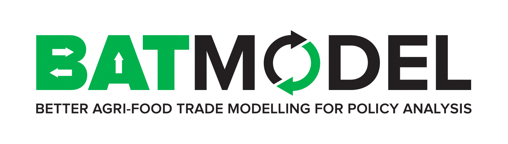
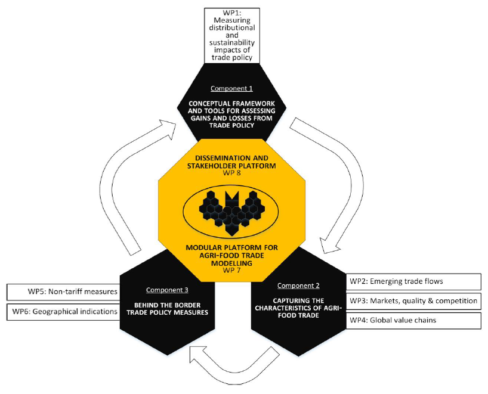

In the BATMODEL project 15 organizations and research institutes from 10 EU countries cooperate to create better cross-border agricultural trade models than has been the case so far, thus helping decision-makers to achieve better multilateral and regional agreements. As “next generation” trade agreements are not limited to changes in tariffs and tariff quotas and include elements such as growing consumer concerns about food quality and safety or the enforceability of labour market considerations, models used in assessments also need to broaden their scope.

BATMODEL is organized around 7 topic focussed work packages each combing econometric and at least one simulation models included in the project (CAPRI, CGEbox, MAGNET, MIRAGE). The MAGNET team contributes to three of the work packages. 

In WP1 (Measuring distributional and sustainability impacts of trade policies) we contribute to an ex-ante framework for well-being assessment, moving away from a consumption-based assessment of trade agreements. As employment changes are key to for distributive impacts this one core topic where a new MAGNET labour market module will be developed.  A second core topic is improving an extending SDG indicators linked to food consumption and potential health impacts. 

In WP4 (Global value chains) the MAGNET team contributes to an improved database of the increasingly complex international trade network. Standard trade statistic, however, only partially capture this complexity by only registering trade at the border but not its use by sectors or households. Using detail data on trade flows and product characteristics a new GVC database is constructed that better traces the destination of imported commodities thus better capturing global networks. Building on this database a GVC module for MAGNET will be developed to improve assessments of how changes in household demand ripple through the global economy. The new module aims to deliver new indicators on GVCs like the length of production stages and an index of participation in GVCs.

In WP7 (Modelling platform) the MAGNET team contributes to the development of open-source BATMODULES that make the BATMODEL model developments available for wider use. These modules are based on a documentation and coding guideline aiming to improve he model quality as well as transferability of knowledge. Bringing in over more than a decade of experience with modular development we aim to set a practical standard for model enhancements to support cooperation and transfer of knowledge across model teams. The output from WP7 is a series of modules coded in both GAMS and GEMPACK, tested in at least two models and documented such that model teams outside the project can incorporate these enhancements in their own models. Through this BATMODULE platform we aim to make the model enhancements from this project last well beyond the project lifetime.
	 
