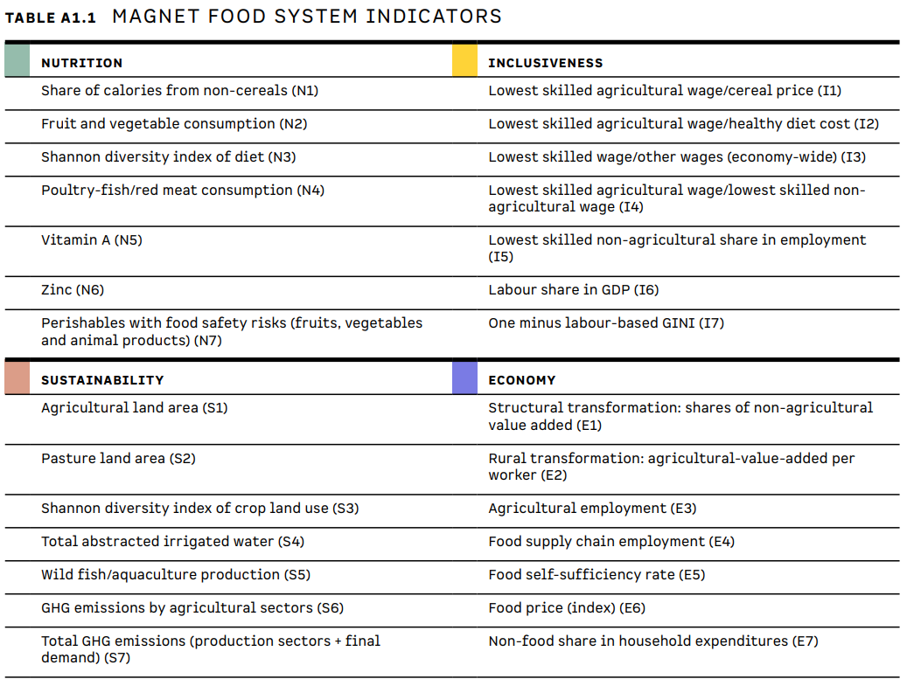
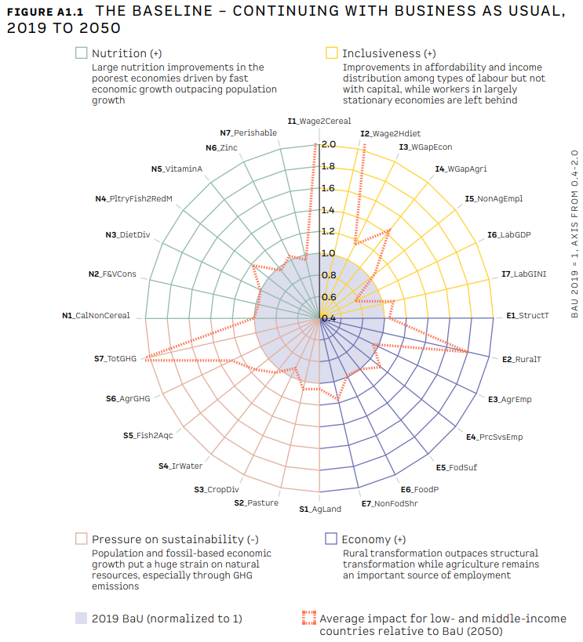
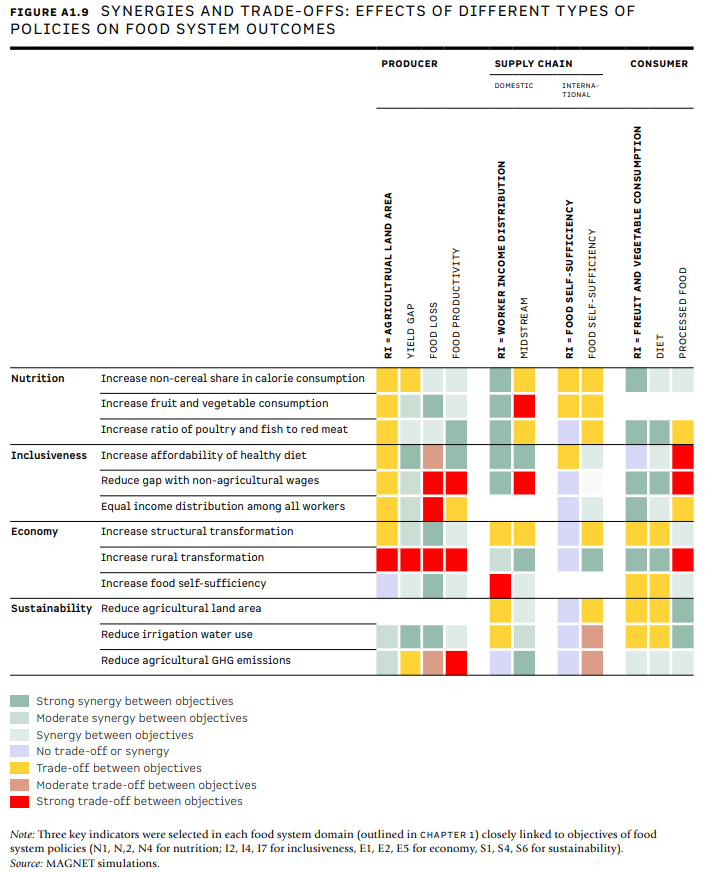

The IFAD Rural Development Report 2021 (RDR 2021)  focuses on transforming food systems for rural prosperity. While the report focuses on improving rural livelihoods the impacts of food system changes may well stretch far beyond rural economies affecting consumers, workers in in non-agriculture, international trade flows and so on. MAGNET has been used to explore such economywide impacts of different food system scenarios across four dimensions.

For the this study we refined the representation of labour in MAGNET, moving from two to 5 occupation based labour types. Making the number of workers per type and sector explicit allowed new measures of employment, wages and wage income inequality define by a labour based GINI. Combined with existing variables in MAGNET we defined 28 food system indicators across 4 dimensions (nutrition, inclusiveness, sustainability, economy)

*Source: [Annex 1, IFAD Rural Development Report 2021](https://www.ifad.org/documents/38714170/43704363/rdr2021_annex1.pdf/f412bd1e-8e70-b254-45c9-e01f2f7ec1df?t=1631621446115)*

Average trends on these food system indicators for low- and middle income countries in the Business as Usual (BaU) baseline scenario (2019-2050) can be summarized in a spider diagram, highlighting for each dimension the core trends. 
 

*Source: [Annex 1, IFAD Rural Development Report 2021](https://www.ifad.org/documents/38714170/43704363/rdr2021_annex1.pdf/f412bd1e-8e70-b254-45c9-e01f2f7ec1df?t=1631621446115)*

Similar spider diagram summaries compare 7 counterfactual scenarios to developments in the BaU. These counterfactual scenarios address interventions in specific parts of the food system aligned with the RDR 2021 chapters.  A correlation analysis on the results is used to highlight patterns trade-offs an synergies not easy to detect from the large number of indicators and scenarios, selecting 3 key indicators for each food system domain.

*Source: [Annex 1, IFAD Rural Development Report 2021](https://www.ifad.org/documents/38714170/43704363/rdr2021_annex1.pdf/f412bd1e-8e70-b254-45c9-e01f2f7ec1df?t=1631621446115)*

Primary productions in production through reducing yield gaps, reducing food loss or increasing food productivity all reduce the agricultural land area. Overall reducing the agricultural land area show trade-offs with nutrition, inclusiveness and economy indicators while generating synergies with sustainability objectives. The results by scenario show, however, that the type of intervention inducing the agricultural area contraction has a major impact on the observed trade-offs and synergies. The same importance of choice of instrument or intervention we find for the types of intervention in the supply chain (stimulating mid-stream employment, promoting food self-sufficiency) and consumer focussed interventions (healthy diet, reduction in processed food consumption). 

As none of the columns has only green markers signalling synergies the main take-aways from this study is that (i) a food system transformation cannot avoid trade-offs; and (ii) trade-off and synergies can be shaped through intervention design stressing the need for careful and context specific policy design. MAGNET simulations can support such context specific policy designs as the detailed results in the background paper highlight opposing impacts across different country groups. For more information, see the [background report](https://www.ifad.org/documents/38714170/43704363/rdr2021_sinergies.pdf/a40f6da5-0a67-5b73-9e60-e2efc4e7a82b?t=1631621453329).

Contact: [Marijke Kuiper](/author/marijke-kuiper/), [Monika van den Bos Verma](/author/monika-verma/)

	 
