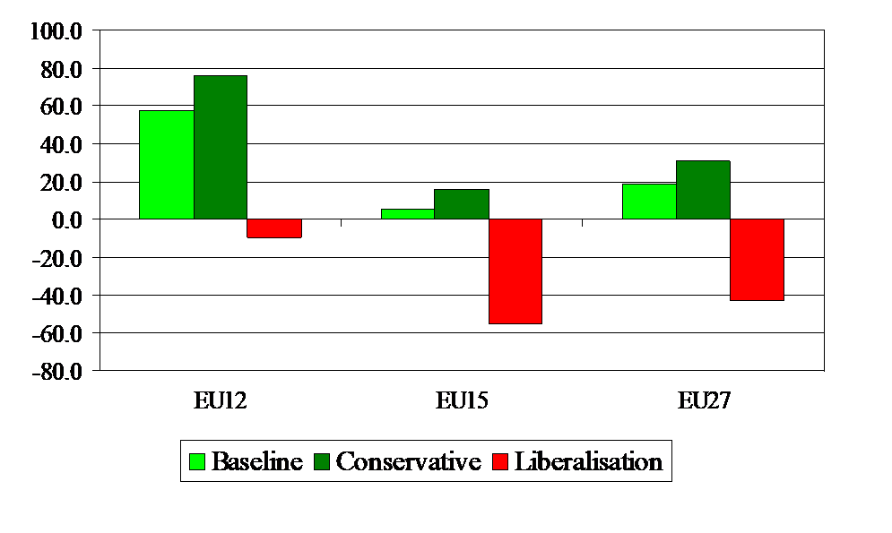
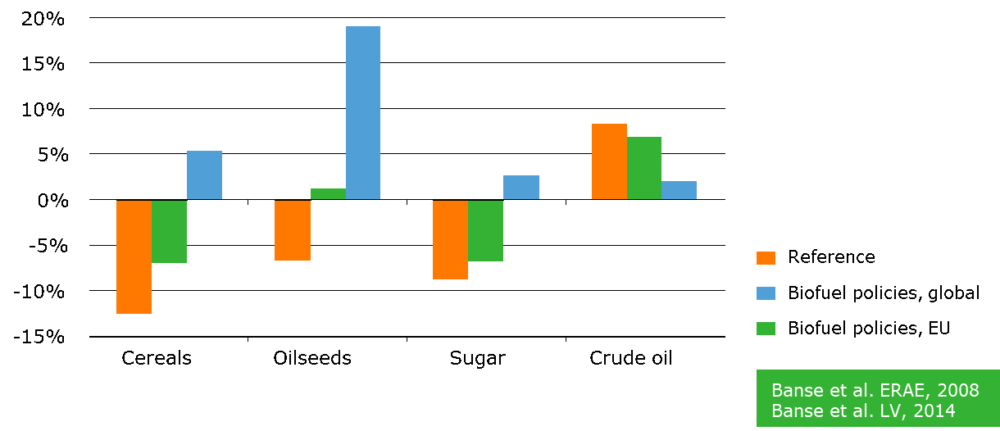
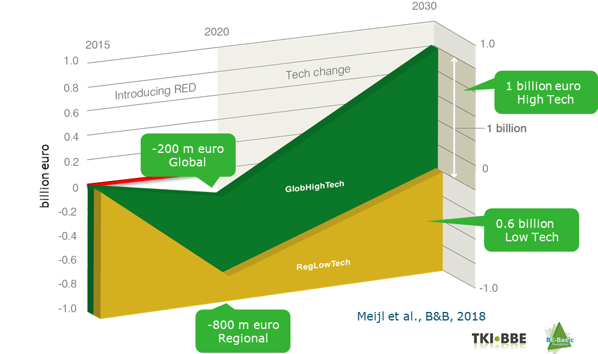
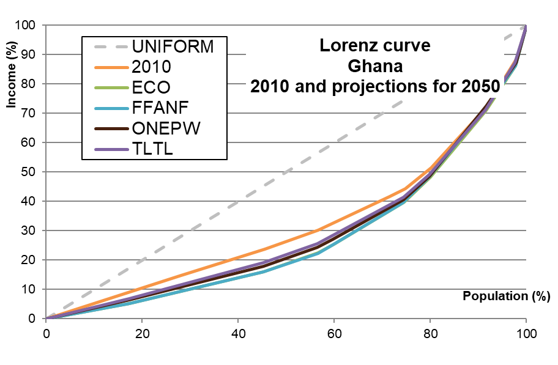
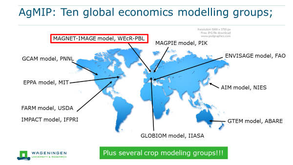
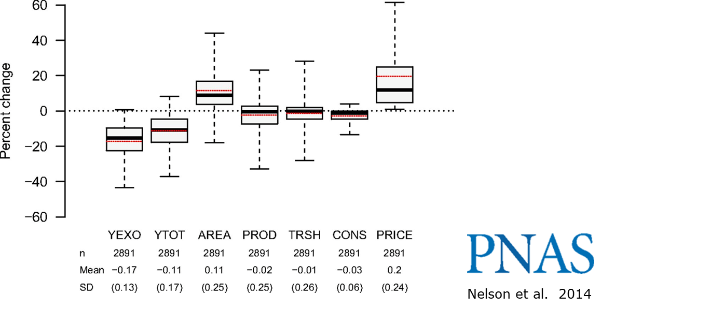
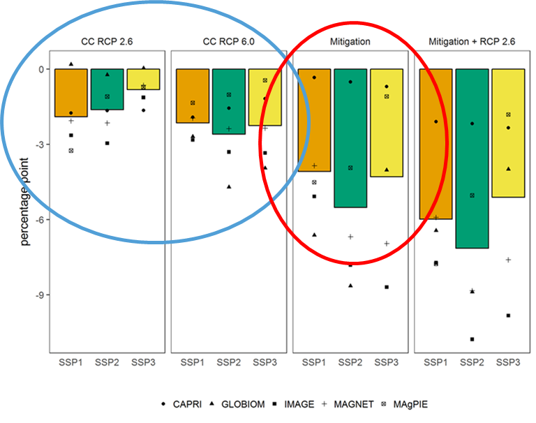

---
# An instance of the Blank widget.
# Documentation: https://sourcethemes.com/academic/docs/page-builder/
widget: blank

# Activate this widget? true/false
active: true

# This file represents a page section.
headless: true

# Order that this section appears on the page.
weight: 15

title: Research
subtitle:

design:
  columns: "1"
  
  
---

MAGNET has the ability to combine generally separate strands of research in a flexible and coherent manner. The model is unique in comprising food security, sustainability and inclusiveness in a single economy-wide framework. In contrast to partial agri-food models MAGNET covers income feedback loops and the full (bio)economy, thus capturing feedback between primary and industrial sectors beyond the grasp of partial models (Banse et al. 2011, Van Meijl et al. 2018). This wider coverage comes at the costs of technological detail, which is addressed by allowing a link to partial models like IMAGE and GLOBIOM, to exploit each other’s comparative advantage (van Meijl et al. 2006, Doelman et al. 2018, Frank et al. 2019). MAGNET can also be combined with technical models like TIMER or MARKAL (Wicke et al. 2015, van Meijl et al. 2018), capturing adjustments in cost structures as well as smoothing changes in technology due to economic feedback loops not accounted for in these technology focussed models.

Compared to other CGE models MAGNET has more bio-economy detail absorbed through the cooperation with non-economic models and combines all its extensions into a single model instead of parallel studies by different teams of researchers. It also includes climate specific modules as GHG emissions and stock, potential and actual temperature change and CO2 taxes. In fact MAGNET has been designed and developed as a team-based model connecting specialist expertise from different areas of research in a single model platform. To avoid an excessive complexity in specific applications, the model has been given a modular structure, allowing researchers to exploit the model extensions tailored to the question at hand. Hence there is no single “MAGNET model” but the model’s scope can easily be adjusted both in terms of model structure and data preparation.

MAGNET has been successfully applied to support policymakers across different themes. Examples are in the field of [trade policies](#trade), GMOs, and [technical change](#tech) (Meijl and Tongeren 1998, 1999, Huang et al 2004, Francois et al. 2005, Smeets-Kriskova et al. 2017a, 2017b), agricultural and land use policies (Meijl et al. 2006, Nowicki et al. 2009, Banse et al. 2008), biobased economy (Banse et al. 2008, Meijl et al. 2018a), food security (Kuiper et al. (2020), Van Meijl et al. 2020), climate (Nelson et al. 2013, Meijl et al. 2018b, Hasegawa et al. 2018, Frank et al. 2019).  These past applications show how MAGNET, through to its modular team-based form, addresses the need for flexible yet coherent assessments of policies across multiple and sometimes inherently conflicting objectives of SDGs and the Paris agreement.

## Theme 1: Trade Policies {#trade}

From its inception, trade policy analyses has been at the core of the GTAP model. Also at Wageningen Economic Research the first focus was on trade policies. In a Doha trade liberalisation study for the Dutch Ministry of Economic Affairs the model was extended with dynamic effects such as economies of scale in manufacturing sectors and non-tariff measures (Francois et al., 2005). The estimated benefits were USD 200 billion in case of partial liberalisation and USD 700 billion in case of full liberalisation. Trade facilitation, agricultural liberalisation, and Manufacturing & Services liberalisation each contribute one third to these results. The study underlined the importance of trade policy reform by developing countries themselves as these contributed 25% of total world benefits. Gains were particularly from liberalizing South-South trade (initial high level of protection).

Most recently, in 2020-21, MAGNET modellers analysed implications of the Mercosur agreement on the Dutch economy. They also initiated work on the “new generation” trade agreements, that are not limited to changes in tariffs and tariff rate quotas, but also include provisions on sanitary and phytosanitary (SPS) measures (part of which are called non-tariff measures, NTMs), geographical indications (GIs), and public procurement and capital flows. MAGNET modellers will be enhancing the representation of traditional and “behind the border” trade policies in the BATMAN Modular Platform for Agri-food Trade Modelling. These improvements will provide new insights into the impacts, such as the distribution of gains and losses of trade agreements between and within member states, sectors and agents.

## Theme 2: Technical change and Investments {#tech}

From the beginning MAGNET payed special attention to technological change, and international knowledge spillovers and GMOs. International knowledge spillovers are not perfect and dependent on the absorption capacity, the structural similarity between countries and whether technologies are socially acceptable. A result is that trade protection is more negative as it not only tempers cheaper imports but also the knowledge embodied in these commodities (Van Meijl and Van Tongeren, 1998, 1999, 2004). Based on unique data from empirical micro-level study and field trials of Bt corn and GM maize in China, our results indicated that the welfare gains from the development of biotechnology outweigh the public biotechnology research expenditures. Most gains occur inside China, and can be achieved independently from biotech-unfriendly polices adopted in some industrialized countries (Huang et al., 2004).

In a series of papers we opened the black box of tech change a bit further by including the dynamic effects of an explicit R&D sector that produces factor augmenting technical change (Smeets-Kriskova et al. 2016, 2017a, 2017b). In 2020, we made next step and worked towards improving MAGNET investment behaviour. The reason for this has been the European Green Deal growth strategy that aims to transform the EU into resource-efficient and competitive economy, with no net emissions of greenhouse gases in 2050. Using MAGNET for investment impact analysis requires that modelling investments is guided by a proper sector investment allocation mechanism, allowing to steer investments into the sectors that are “green”, or aligned with the EU taxonomy. Sector allocation of investments has been our priority in 2020-21.

## Theme 3: Land and Agriculture

At the beginning of the new millennium, the Dutch Environmental Assessment Agency (PBL) was looking for cooperation to assess both the economic and environmental aspects of policy changes. While land use changes were key in IMAGE model (Alcamo et al. 1998, Stehfest, et al. 2014) in MAGNET - as in other CGE models - they were exogenous. In a co-creation process, we developed an innovative land supply curve and empirically underpinned it with the IMAGE data (Van Meijl et al. 2006, Eickhout et al. 2007). The linkage of the economic and detailed land use model enabled consistent economic and environmental indicators and enabled unique contributions to the OECD Environmental Outlook, TEEB (The Economics of Ecosystems and Biodiversity), Global Land use Outlook, and Rio plus20: Pathways to achieve global sustainability goals by 2050. 

*Figure 3. Scenar2020, Change in Land Prices, EU 2007-2020, in per cent (Nowicki et al., 2009)* 

The EUruralis project, in which the IMAGE-MAGNET system was coupled with the land allocation model CLUE and many other environmental indicators of Wageningen Environmental Research enabled a broad perspective and many new developments within MAGNET (Klijn et al., 2015, Rienks, et al. 2008, Verburg et al. 2008). For MAGNET it implied that in this period agricultural and land use related modules, segmented labour markets, and a specific Common Agricultural Policy (CAP) module were added. This opened the door for the influential Scenar2020 studies for DGAgri of the European Commission (Figure 3). In SCENAR2020, Wageningen Economic Research assessed key Common Agricultural Policy scenarios for DGAgri. The study concluded that liberalisation would not lead to a huge reduction in agricultural production in the EU, as was often feared, but to a strong decrease in land prices (40%), as shown in Figure 3, and severe structural change as the number of farmers would further decrease (Nowicki et al. 2006, 2009, Banse et al. 2008a). So, the CAP was not a policy to secure food production in the EU but a social policy. At  the end it was the only impact study mentioned in the new CAP proposal of the EC. 

## Theme 4: Bio-based economy

In early 2000s, biofuels entered the agricultural arena and the EU biofuel directive of 10% biofuels induced a new policy-driven demand category for agricultural products and created a direct linkage between the agricultural and energy markets (Banse et al. 2008b, 2011,2014). Figure 4 shows that the long-term declining trend in real agricultural prices (in orange) may slow down or even reverse, when biofuels (in green) enter the scene. Noticeable is also a slight drop in fossil fuel prices as fossil is substituted by biomass, which will create the already mentioned rebound effect (Smeets et al. 2014).

However, not only the EU but many other countries were considering biofuels. If all the countries would implement their biofuel plans, the food prices would increase substantially and the long-term negative trend might be reversed. For example, no decline in cereal prices of 12 % but an increase by 5% would result (blue bars in Figure 4). When food prices increased in 2005, the 1st generation biofuels came under pressure in the public debate. We showed that using the 2nd generation biofuels based on lignocellulosic materials had less impact on prices and land use. 

For the governance of Malaysia we found that especially biobased chemicals and materials, based on palm oil residues and waste, are a source for value added and reducing dependency on fossil fuels (Meijl et al. 2012).

*Figure 4. Impact of Biofuel policies on World Prices (% ‘01 - ‘20)* 
 
In another study, (the Macro-economic assessment for the Dutch biobased Economy Top sector; MEC-BBE), we included the first and second generation biofuels, bioelectricity and various bio-based chemicals in MAGNET (Van Meijl, et al. 2016, 2018a). The model results showed that short term compliance with the 14% renewable energy targets creates a negative GDP effect of 200 million euro with global sourcing and 800 million with regional sourcing (Figure 5).

This is because fossil technologies have to be substituted with more costly bio-based technologies. The recent developments in wind- and sun-induced energy suggest that the latter gets much more quickly competitive with fossil fuels and could reduce these negative effects. The positive effect of possible new technology investments becomes only visible after 2020. In the High Tech scenario the benefits for the Netherlands will be 800 million and therefore the technology investments add each year 1 billion USD. These effects are obviously very dependent on the oil prices. High fossil energy prices make bio-based substitutes more competitive and therefore lead to higher macro-economic impacts.

*Figure 5. MEV- BBE: Annual GDP effect of a bio-based economy on GDP in billion euros compared to non-biobased (Van Meijl, et al. 2016, 2018a).* 
 
 
The MAGNET model was extended towards the wider bioeconomy by including a biofuels, bioelectricity and biobased chemicals moduleapplied bioeconomy assessments to the EU level (Van Meijl et al. 2018a). Philippidis et al. (2018a, 2019).

## Theme 5: Food and nutrition security

The food price spike of 2005 put agricultural markets and food security high on the political agenda. For decades low prices were taken for granted and investments in agricultural R&D were low. In the FP7 FOODSECURE project coordinated by Wageningen Economic Research, stakeholders developed their own food security scenarios around two key uncertainties (Van Dijk et al., forthcoming; see Figure 6). 
Figure 6. FOODSECURE scenario storylines
 
The first one, depicted on the vertical axis, is the often-used sustainability axis to take the environment and the climate into account. The second, and a unique one in long-term modelling, is the equality-inequality axis, which is represented by the horizontal axis. It is about inclusiveness. This is all about income, wealth and health distribution which is under pressure currently. By combining the two key uncertainties, stakeholders created the four FOODSECURE scenarios. The purple “Too Little Too Late” scenario represents an unequal and unsustainable world, which might well represent the current world given the situation regarding the grand societal challenges that I discussed before. At the other extreme is the green Ecotopia scenario, a sustainable and inclusive world which might be our desired world. To flow from the current to the desired worldview is the challenge of humanity.

FOODSECURE embraced a broad definition of food security taking food availability, food access (food purchasing power), food utilisation (e.g. nutrition) and food stability into account (Van Meijl et al. 2020a , 2020b). Household models were developed to take the income and diet expenditures into account at household level (Kuiper et al. 2020).

*Figure 7. Inequality axis: Future growth not pro-poor, rationale for redistributive policy; 2010 (initial situation), ECO (Ecotopia), FFANF (Food for all but not forever), ONEPW (1% world), TLTL (Too little too late).* 
 
 
The Lorenz curve, a graphical representation of the distribution of income or of wealth, for Ghana (Figure 7), shows that the 20% richest people earn half of the total income. The results of the FOODSECURE scenario were striking. In all four scenario’s the income inequality increased due to the existing macro mechanism. Education and social mobility (rural urban migration) might change this pattern. Quantification of the FOODSECURE scenario’s showed also that food availability increases in all scenario’s. However, in general this leads also to more GHG emissions. Only in Ecotopia scenario food availability increases and emissions decrease. Relatively high yields and change in behaviour by reducing waste and changed preferences away from meat contributed to this. Our modular model was extended with multiple households, aid policies and various nutrients.

## Theme 6: Climate Change

Plausible estimates of the climate change impacts require combined use of climate, crop, and economic models. Results from previous studies vary substantially due to differences in models, scenarios, and data. In the agricultural modelling comparison project (AgMIP), we sought to understand the differences between nine world leading economic models based on a harmonised set of scenarios (Nelson et al. 2013, Von Lampe et al. 2014, Stehfest et al. 2019). Partial equilibrium, general equilibrium and integrated assessment models were considered (see Figure 8).

*Figure 8. AgMIP: Ten global economics modelling groups* 
 
 
AgMIP quantified the impact of a climate change scenario with a radiative forcing 8.5 watts per square meter by 2100 (Nelson et al. 2013, Von Lampe et al. 2014; Figure 9). The exogenous negative yield impact is 17%. Endogenous economic responses reduce yield loss to 11%, increase the area of major crops by 11%, reduce consumption by 3%, and increase agricultural prices by 24%. Agricultural production, cropland area, trade, and prices show the greatest degree of variability in response to climate change, and consumption the lowest.

*Figure 9. Impacts of Climate Change in 2050 (8.5 W/m2)* 
 

In an ERL 2018 paper, we compared climate change impacts relative to the impact of mitigation measures to stabilize global warming at 2◦C by the end of the century under different Shared Socioeconomic Pathways (Van Meijl et al. 2018b; Figure 10). The impact of only climate change on agricultural production is negative (the two scenarios in the blue circle). A larger negative effect on agricultural production, most pronounced for ruminant meat production, is observed when emission mitigation measures compliant with a 2 ◦C target are put in place (within red circle). In a Nature Climate Change (NCC) 2018 paper, a robust finding is that by 2050, stringent climate mitigation policy would have a greater negative impact on global food security than the impacts of climate change (Hasegawa et al. 2019). These results do not negate the need for mitigation efforts, but rather highlight the need for policy designs that explicitly include complementary measures in order to avoid an increase in hunger and malnutrition (see also Fujimori, et al. 2019). Recently in a 2019 ERL paper we showed that 9% crop productivity growth is needed to mitigate the food security effect and with meat diet changes this would be 7% (Doelman et al. 2019). A second NCC article (Frank et al. 2019) found that agriculture may contribute emission reductions of 0.8–1.4 GtCO2e per year at just 20 USD per tCO2e in 2050. Combined with dietary changes, emission reductions can be increased to 1.8 GtCO2e per year. At carbon prices compatible with the 1.5 °C target, agriculture could save almost 4 Gt CO2e per year in 2050, which represents around 8% of current greenhouse gas emissions. Recently the MAGNET model is extended with a climate change module.

*Figure 10. Climate change and mitigation impacts on total global agricultural production by 2050 (ERL, Van Meijl, et al. 2018).* 
 

